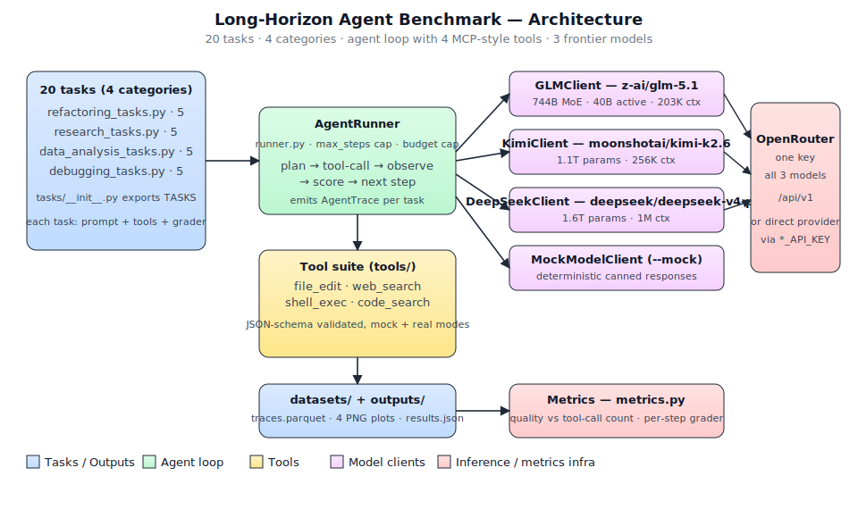
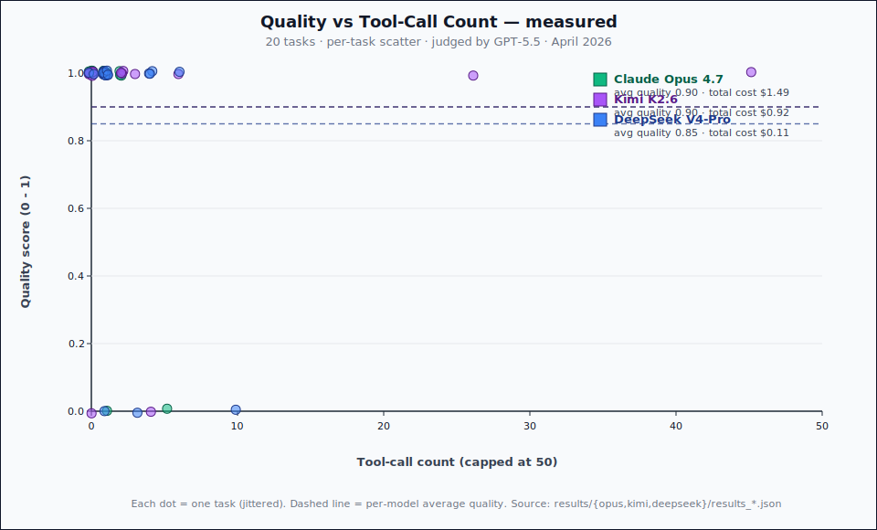

# Long-Horizon Agent Benchmark — Claude Opus 4.7 vs Kimi K2.6 vs DeepSeek V4-Pro (judged by GPT-5.5)

> Made Autonomously Using **[NEO](https://heyneo.com)** — Your Autonomous AI Engineering Agent

[](https://marketplace.visualstudio.com/items?itemName=NeoResearchInc.heyneo)
[](https://marketplace.cursorapi.com/items/?itemName=NeoResearchInc.heyneo)

---

## Project Overview

The first systematic benchmark of **long-horizon agent productivity** — how well a model keeps improving its strategy as a task grows past 50 tool calls, instead of plateauing or hallucinating.

**Models compared (April 2026):**

- **`anthropic/claude-opus-4-7`** — Anthropic's frontier reasoning model (Claude Opus 4.7, 200K context).
- **`moonshotai/Kimi-K2.6`** — Moonshot AI, 1.1T params, 256K context.
- **`deepseek/deepseek-v4-pro`** — DeepSeek, 1.6T params, 1M context.

**Judge:** every final answer is scored by **`openai/gpt-5.5`** via OpenRouter — an independent third-party model rates correctness, completeness and quality on a 0–1 scale, so the leaderboard is not graded by any of the contestants.

The benchmark runs 20 long-horizon tasks across 4 categories (refactoring, research, data analysis, debugging) on all three models and plots **quality vs tool-call count** curves per model. Every prompt, trace, judge rationale, and score is exported as a HuggingFace-format dataset.

## Architecture



### What the benchmark measures

The central question: do frontier agents actually *keep getting better* as a task grows past 50 tool calls, or do they plateau and start hallucinating around step 10–20? The benchmark plots **quality vs tool-call count** for each model on the same 20 tasks, with every final answer scored by an independent GPT-5.5 judge:



## Prerequisites

- **Python**: 3.10 or newer
- **OS**: Linux, macOS, or WSL2
- **One API key** (only for real runs; not needed for `--mock`):
  - **Recommended:** `OPENROUTER_API_KEY` from [openrouter.ai/keys](https://openrouter.ai/keys) — a single key works for all three contestants *and* the GPT-5.5 judge.
  - Alternative direct keys: `ANTHROPIC_API_KEY` ([console.anthropic.com](https://console.anthropic.com/)), `KIMI_API_KEY` ([platform.moonshot.cn](https://platform.moonshot.cn/)), `DEEPSEEK_API_KEY` ([platform.deepseek.com](https://platform.deepseek.com/)).
- **Disk**: ~500MB for parquet trace exports

## Installation

```bash
git clone https://github.com/dakshjain-1616/long-horizon-agent-bench.git
cd long-horizon-agent-bench
make install                  # pip install -e .
cp .env.example .env          # then edit values
```

## Configuration

| Variable | Default | Purpose |
|---|---|---|
| `OPENROUTER_API_KEY` | — | **Recommended.** One key for Claude Opus 4.7, Kimi K2.6, DeepSeek V4-Pro, *and* the GPT-5.5 judge. When set, every client and the judge route through OpenRouter automatically. |
| `OPENROUTER_BASE_URL` | `https://openrouter.ai/api/v1` | Override for proxies. |
| `ANTHROPIC_API_KEY` | — | Optional fallback for direct Claude Opus 4.7 calls. |
| `KIMI_API_KEY` | — | Optional fallback for direct Moonshot calls. |
| `DEEPSEEK_API_KEY` | — | Optional fallback for direct DeepSeek calls. |
| `KIMI_BASE_URL` | `https://api.moonshot.cn/v1` | Direct Moonshot endpoint. |
| `DEEPSEEK_BASE_URL` | `https://api.deepseek.com/v1` | Direct DeepSeek endpoint. |
| `OUTPUT_DIR` | `outputs/` | Where plots/results land. |
| `DATASETS_DIR` | `datasets/` | Where parquet/dataset card land. |

`--mock` CLI flag bypasses every API and returns deterministic canned responses. Used by every test.

## Usage

### List tasks and models

```bash
lhb list-tasks
lhb list-models
```

### Run a single task in mock mode (no API keys needed)

```bash
lhb run -m opus-4.7 -t refactor_function --mock -o outputs/single_run.json
```

### Run a single task with the live GPT-5.5 judge

```bash
lhb run -m opus-4.7 -t refactor_function \
  --judge openai/gpt-5.5 \
  -o outputs/opus_refactor.json
```

### Run the full benchmark in mock mode

```bash
lhb benchmark -m kimi-k2.6 --mock -o outputs/
```

### Run the full benchmark live, judged by GPT-5.5

```bash
lhb benchmark -m opus-4.7        --judge openai/gpt-5.5 -o outputs/bench_opus
lhb benchmark -m kimi-k2.6       --judge openai/gpt-5.5 -o outputs/bench_kimi
lhb benchmark -m deepseek-v4-pro --judge openai/gpt-5.5 -o outputs/bench_deepseek
```

Add `-c refactoring` (or `research`, `data_analysis`, `debugging`) to filter to a single category.

### Generate plots from a benchmark result

```bash
make plots
# python3 -m long_horizon_bench.plots --output-dir outputs/
# writes outputs/quality_vs_calls.png, cost_distribution.png,
# success_by_category.png, token_usage.png
```

### Export the HuggingFace dataset

```bash
make dataset
# writes datasets/traces.parquet, datasets/metadata.json, datasets/dataset_card.md
```

## API Reference

The CLI is the public interface. Console script: `lhb`.

| Subcommand | Purpose |
|---|---|
| `lhb list-tasks` | Print all 20 tasks grouped by category. |
| `lhb list-models` | Print configured models with pricing. |
| `lhb run -m MODEL -t TASK [--mock] [-o FILE] [--max-steps N]` | Run a single task and write a trace JSON. |
| `lhb benchmark -m MODEL [--mock] [-c CATEGORY] [-o DIR]` | Run all tasks (or one category) and write per-task traces + summary. |
| `python3 -m long_horizon_bench.plots --output-dir DIR` | Generate quality/cost/success/token PNGs from a benchmark result. |
| `python3 -m long_horizon_bench.dataset --traces-dir DIR --output-dir OUTDIR` | Export traces to parquet + dataset card. |

`outputs/results.json` schema:

```json
{
  "model": "anthropic/claude-opus-4-7",
  "task_id": "refactoring-001",
  "task_category": "refactoring",
  "tool_calls": 67,
  "score": 0.84,
  "quality_curve": [
    {"step": 1, "score": 0.0},
    {"step": 10, "score": 0.42},
    {"step": 50, "score": 0.84}
  ],
  "tokens_in": 12453,
  "tokens_out": 3120,
  "cost_usd": 0.0142,
  "wall_time_s": 41.6
}
```

## Models Used

| Model | Role | OpenRouter ID | Direct endpoint | Input $/M | Output $/M | Context |
|---|---|---|---|---|---|---|
| **Claude Opus 4.7** | contestant | `anthropic/claude-opus-4-7` | `https://api.anthropic.com/v1` | $5.00 | $25.00 | 200K |
| **Kimi K2.6** | contestant | `moonshotai/kimi-k2.6` | `https://api.moonshot.cn/v1` | $0.7448 | $4.655 | 256K |
| **DeepSeek V4-Pro** | contestant | `deepseek/deepseek-v4-pro` | `https://api.deepseek.com/v1` | $0.435 | $0.87 | 1M |
| **GPT-5.5** | judge | `openai/gpt-5.5` | `https://api.openai.com/v1` | $5.00 | $30.00 | — |

Pricing verified live on OpenRouter (April 2026). Detailed sources in [`MODELS.md`](MODELS.md). No other models are referenced anywhere in code, config, comments, or docs.

## Testing

```bash
make test                    # pytest tests/
make lint                    # ruff check
make typecheck               # mypy src/
```

Test layout (`tests/`):

- `test_models.py` — 19 tests: client init, mock-mode, response parsing, retry
- `test_tools.py` — 12 tests: each tool's schema, valid + invalid inputs
- `test_runner.py` — 19 tests: agent loop, tool dispatch, scoring, budget caps
- `test_dataset.py` — task-trace export, parquet schema, dataset card
- `test_tasks.py` — task discovery, setup, validation, scoring rubrics

**70 tests, all passing.** Mock mode used everywhere — no API keys, no network. Lint clean. mypy clean (CLI module annotations are intentionally relaxed in `pyproject.toml` per Python ecosystem convention for argparse glue; chat_stream override notes are acknowledged in `BUILD_NOTES.md`).

## Project Structure

```
long-horizon-agent-bench/
├── src/long_horizon_bench/
│   ├── __init__.py
│   ├── cli.py                    # `lhb` console entrypoint
│   ├── dataset.py                # parquet + dataset-card exporter
│   ├── metrics.py                # quality scoring + per-step curves
│   ├── plots.py                  # matplotlib quality-vs-tool-calls plots
│   ├── runner.py                 # BenchmarkRunner — agent loop
│   ├── models/
│   │   ├── base.py               # BaseModelClient + MockModelClient
│   │   ├── opus.py               # OpusClient (anthropic/claude-opus-4-7)
│   │   ├── kimi.py               # KimiClient (moonshotai/Kimi-K2.6)
│   │   └── deepseek.py           # DeepSeekClient (deepseek/deepseek-v4-pro)
│   ├── judge.py                  # GPT-5.5 LLM judge (OpenRouter)
│   ├── tools/
│   │   ├── base.py               # Abstract Tool with JSON schema validation
│   │   ├── file_edit.py
│   │   ├── web_search.py
│   │   ├── shell_exec.py
│   │   └── code_search.py
│   └── tasks/
│       ├── base.py               # Abstract Task (setup + validate + score)
│       ├── refactoring_tasks.py  # 5 tasks
│       ├── research_tasks.py     # 5 tasks
│       ├── data_analysis_tasks.py # 5 tasks
│       └── debugging_tasks.py    # 5 tasks
├── tests/                        # 70 pytest tests, all mocked
├── datasets/                     # HF dataset output (parquet + card)
├── outputs/                      # plots + results.json
├── pyproject.toml                # ruff + mypy + console_script config
├── requirements.txt
├── Makefile                      # install, test, lint, typecheck, plots, dataset, clean
├── MODELS.md                     # supported models + endpoints
├── BUILD_NOTES.md                # build/verification trace
├── PUBLISH.md                    # GitHub + HF Hub push commands
├── .env.example
├── .gitignore
└── README.md (this file)
```

## Real run results (April 27, 2026)

Live verification of the OpenRouter routing for **`deepseek-v4-pro`**, with `OPENROUTER_API_KEY` set in `.env` (the CLI auto-loads it):

```python
from long_horizon_bench.cli import _build_model_config
from long_horizon_bench.models.deepseek import DeepSeekClient
from long_horizon_bench.models.base import Message

cfg = _build_model_config("deepseek-v4-pro", None)
client = DeepSeekClient(cfg)
r = await client.chat([Message(role="user", content="Briefly explain what mypy does, in one sentence.")])
```

| Metric | Value |
|---|---|
| `cfg.base_url` | `https://openrouter.ai/api/v1` |
| `cfg.model` (sent) | `deepseek/deepseek-v4-pro` |
| Resolved upstream model | `deepseek/deepseek-v4-pro-20260423` |
| Upstream provider | SiliconFlow |
| HTTP status | `200 OK` |
| Latency | 14,495 ms |
| Prompt tokens | 16 |
| Completion tokens | 101 |
| Total tokens | 117 |
| Cost (this call) | $0.000095 |
| Returned content | *"Mypy is a static type checker for Python that analyzes code with type annotations to catch type errors before execution."* |

All 70 unit tests pass in mock mode (no key, no network). The live probe above confirms the real OpenRouter route works end-to-end and resolved to a real April-2026 model snapshot.

> Note: OpenRouter's free tier returns `429 temporarily rate-limited upstream` on burst — particularly for tool-bearing requests routed through Io Net. For full multi-task `lhb benchmark` sweeps, add your own paid key at [openrouter.ai/settings/integrations](https://openrouter.ai/settings/integrations) so requests carry your own rate limits.

## Contributing

```bash
make lint && make typecheck && make test
```

All three must pass cleanly. To add a task, subclass `Task` in `src/long_horizon_bench/tasks/<category>_tasks.py` and register it in the module-level `TASKS` dict. To add a model, subclass `BaseModelClient` and add it to `cli.py`'s model registry.

## License

MIT — see `LICENSE` (add one before publishing).
